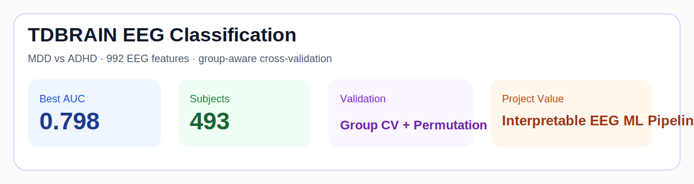

# TDBRAIN EEG Classification / TDBRAIN 脑电分类项目


## At a glance / 项目速览

| Item | Summary |
|------|---------|
| Task | MDD vs ADHD EEG classification / 抑郁症与 ADHD 脑电分类 |
| Dataset | TDBRAIN |
| Best result | **AUC 0.798** |
| Validation | 5-fold StratifiedGroupKFold + permutation test |
| Project value | EEG ML, feature engineering, strict leakage control |



Resting-state EEG classification pipeline for distinguishing psychiatric conditions on the **TDBRAIN** dataset, with subject-level validation, feature engineering, and statistically validated performance.

一个基于 **TDBRAIN** 数据集的静息态脑电分类项目，重点在于受试者级验证、特征工程，以及经过统计检验的模型表现。

---

## Overview / 项目概述

**Goal / 目标**
- Classify **Major Depressive Disorder (MDD)** versus **ADHD** from resting-state EEG.
- 使用静息态 EEG 区分 **抑郁症（MDD）** 与 **注意缺陷多动障碍（ADHD）**。

This repository represents a practical EEG ML workflow rather than a toy example.

这个仓库体现的是一个真实 EEG 机器学习工作流，而不是简单的示例代码。

---

## Results / 核心结果

| Model | AUC | Accuracy | Sensitivity | Specificity | p-value |
|-------|-----|----------|-------------|-------------|---------|
| SVM | 0.770 | 0.720 | 0.797 | 0.596 | < 0.001 |
| Random Forest | 0.796 | 0.765 | 0.862 | 0.606 | < 0.001 |
| XGBoost | 0.796 | 0.753 | 0.823 | 0.638 | < 0.001 |
| **Ensemble (soft-vote)** | **0.798** | — | — | — | — |

### Dataset summary / 数据概况
- **493 subjects** (305 MDD, 188 ADHD)
- dual-condition EEG: **eyes-open + eyes-closed**
- strict **5-fold StratifiedGroupKFold** subject isolation
- **1000-permutation test**, all main models with **p < 0.001**

---

## Feature Design / 特征设计

The pipeline uses **992 dimensions** of EEG-derived features, combining both eyes-open and eyes-closed conditions.

该项目使用 **992 维 EEG 特征**，融合了睁眼与闭眼两种静息态条件。

### Feature families / 特征类别
- absolute band power
- relative band power
- TBR + FAA
- Hjorth parameters
- broadband spectral entropy
- per-band spectral entropy

### Why this matters / 为什么这很重要
Instead of using a fully black-box model, the project emphasizes interpretable signal features with links to EEG literature.

它没有直接依赖黑箱模型，而是强调与 EEG 文献相呼应、可解释的特征设计。

---

## Pipeline / 技术流程

```text
Raw EEG (.bdf)
  → rereference + filtering
  → epoching + artifact rejection
  → feature extraction
  → EO + EC concatenation
  → train/validation split with subject isolation
  → model selection and evaluation
  → permutation test and interpretation
```

### Key modeling choices / 关键建模设计
- group-aware cross-validation to prevent subject leakage
- oversampling and feature selection inside the training pipeline
- threshold optimization via Youden index
- statistical significance testing via permutation

---

## Repository Structure / 仓库结构

```text
config.py                  # dataset paths, EEG channels, constants
preprocessor.py            # filtering, rereferencing, epoching, artifact rejection
feature_extractor.py       # PSD, Hjorth, entropy features
classifier.py              # model training, validation, ensemble, permutation test
data_loader.py             # raw EEG loading
connectivity_extractor.py  # related connectivity features / extensions
main.py                    # end-to-end pipeline entry
results.json               # result summary
shap_summary.json          # SHAP-based interpretation summary
tests/                     # tests
```

---

## Why this project matters / 为什么这个项目重要

This is one of the clearest examples of how I approach biomedical ML problems:
- domain-aware feature engineering
- strict leakage control
- statistically responsible evaluation
- balancing interpretability and performance

这个项目能很好体现我做生物医学 ML 的方式：
- 领域驱动的特征工程
- 严格避免泄漏
- 更负责任的统计验证
- 在可解释性与性能之间找平衡

---

## Reproducibility / 复现说明

### Requirements
- Python 3.11+
- access to the TDBRAIN dataset

### Install
```bash
pip install mne numpy scipy scikit-learn xgboost imbalanced-learn shap antropy mne-connectivity
```

### Configure dataset path
```python
DATASET_ROOT = Path("/path/to/tdbrain_dataset")
```

### Run
```bash
python main.py
```

Outputs:
- `results.json`
- `shap_summary.json`

---

## Notes / 说明

This repository is intended as a research-oriented project repository.

本仓库更适合作为研究型项目仓库来理解。

A future cleanup would likely include:
- cleaner experiment configuration
- clearer data preparation docs
- better visualization of results and feature importance

后续如果继续整理，我会优先补充：
- 更清晰的实验配置入口
- 更明确的数据准备说明
- 更完整的结果图和解释性可视化


---

## Overview / 项目概述

**Goal / 目标**
- Classify **Major Depressive Disorder (MDD)** versus **ADHD** from resting-state EEG.
- 使用静息态 EEG 区分 **抑郁症（MDD）** 与 **注意缺陷多动障碍（ADHD）**。

This repository represents a practical EEG ML workflow rather than a toy example.

这个仓库体现的是一个真实 EEG 机器学习工作流，而不是简单的示例代码。

---

## Results / 核心结果

| Model | AUC | Accuracy | Sensitivity | Specificity | p-value |
|-------|-----|----------|-------------|-------------|---------|
| SVM | 0.770 | 0.720 | 0.797 | 0.596 | < 0.001 |
| Random Forest | 0.796 | 0.765 | 0.862 | 0.606 | < 0.001 |
| XGBoost | 0.796 | 0.753 | 0.823 | 0.638 | < 0.001 |
| **Ensemble (soft-vote)** | **0.798** | — | — | — | — |

### Dataset summary / 数据概况
- **493 subjects** (305 MDD, 188 ADHD)
- dual-condition EEG: **eyes-open + eyes-closed**
- strict **5-fold StratifiedGroupKFold** subject isolation
- **1000-permutation test**, all main models with **p < 0.001**

---

## Feature Design / 特征设计

The pipeline uses **992 dimensions** of EEG-derived features, combining both eyes-open and eyes-closed conditions.

该项目使用 **992 维 EEG 特征**，融合了睁眼与闭眼两种静息态条件。

### Feature families / 特征类别
- absolute band power
- relative band power
- TBR + FAA
- Hjorth parameters
- broadband spectral entropy
- per-band spectral entropy

### Why this matters / 为什么这很重要
Instead of using a fully black-box model, the project emphasizes interpretable signal features with links to EEG literature.

它没有直接依赖黑箱模型，而是强调与 EEG 文献相呼应、可解释的特征设计。

---

## Pipeline / 技术流程

```text
Raw EEG (.bdf)
  → rereference + filtering
  → epoching + artifact rejection
  → feature extraction
  → EO + EC concatenation
  → train/validation split with subject isolation
  → model selection and evaluation
  → permutation test and interpretation
```

### Key modeling choices / 关键建模设计
- group-aware cross-validation to prevent subject leakage
- oversampling and feature selection inside the training pipeline
- threshold optimization via Youden index
- statistical significance testing via permutation

---

## Repository Structure / 仓库结构

```text
config.py                  # dataset paths, EEG channels, constants
preprocessor.py            # filtering, rereferencing, epoching, artifact rejection
feature_extractor.py       # PSD, Hjorth, entropy features
classifier.py              # model training, validation, ensemble, permutation test
data_loader.py             # raw EEG loading
connectivity_extractor.py  # related connectivity features / extensions
main.py                    # end-to-end pipeline entry
results.json               # result summary
shap_summary.json          # SHAP-based interpretation summary
tests/                     # tests
```

---

## Why this project matters / 为什么这个项目重要

This is one of the clearest examples of how I approach biomedical ML problems:
- domain-aware feature engineering
- strict leakage control
- statistically responsible evaluation
- balancing interpretability and performance

这个项目能很好体现我做生物医学 ML 的方式：
- 领域驱动的特征工程
- 严格避免泄漏
- 更负责任的统计验证
- 在可解释性与性能之间找平衡

---

## Reproducibility / 复现说明

### Requirements
- Python 3.11+
- access to the TDBRAIN dataset

### Install
```bash
pip install mne numpy scipy scikit-learn xgboost imbalanced-learn shap antropy mne-connectivity
```

### Configure dataset path
```python
DATASET_ROOT = Path("/path/to/tdbrain_dataset")
```

### Run
```bash
python main.py
```

Outputs:
- `results.json`
- `shap_summary.json`

---

## Notes / 说明

This repository is intended as a research-oriented project repository.

本仓库更适合作为研究型项目仓库来理解。

A future cleanup would likely include:
- cleaner experiment configuration
- clearer data preparation docs
- better visualization of results and feature importance

后续如果继续整理，我会优先补充：
- 更清晰的实验配置入口
- 更明确的数据准备说明
- 更完整的结果图和解释性可视化
